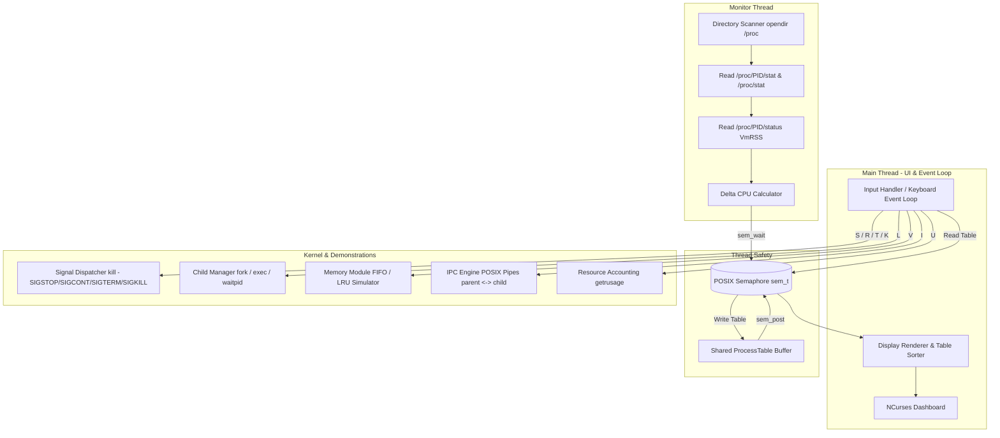

# ⚡ ForgeOS — Linux Process Monitoring & Control System

[](https://en.wikipedia.org/wiki/C_(programming_language))
[](https://www.linux.org/)
[](https://invisible-island.net/ncurses/)
[](https://pubs.opengroup.org/)

**ForgeOS** is a high-performance, multithreaded Linux process monitoring, diagnostic, and control dashboard with an interactive terminal user interface (TUI) powered by **ncurses**. 

It reads kernel metrics from the Linux `/proc` virtual file system in real time, manages process lifecycles using POSIX signals, demonstrates parent-child IPC through UNIX pipes, simulates virtual memory page replacement algorithms (FIFO vs. LRU), and provides deep system resource accounting via `getrusage()`.

---

## 📌 Table of Contents
1. [Key Features](#-key-features)
2. [Course Outcome (CO) Mapping](#-course-outcome-co-mapping)
3. [System Architecture](#-system-architecture)
4. [Project Structure](#-project-structure)
5. [Prerequisites & Dependencies](#-prerequisites--dependencies)
6. [Build & Execution](#-build--execution)
7. [Keyboard Controls & Navigation](#-keyboard-controls--navigation)
8. [Module Deep Dive & Demo Guide](#-module-deep-dive--demo-guide)
9. [Technical Implementation Details](#-technical-implementation-details)

---

## 🚀 Key Features

* **Live Process Table & Real-Time Metrics**: Continuously parses `/proc/[pid]/stat`, `/proc/[pid]/status`, and `/proc/stat` to calculate exact CPU utilization percentages, resident set size (VmRSS memory in KB), and process execution states (`Running`, `Sleeping`, `Stopped`, `Zombie`, `Idle`, etc.).
* **Multi-threaded Worker Architecture**: Decouples UI rendering and user event loops from `/proc` file system I/O using a dedicated POSIX background monitoring thread (`pthread_create`).
* **Concurrency & Synchronization**: Shared process tables are protected against race conditions using POSIX binary semaphores (`sem_t`, `sem_wait`, `sem_post`).
* **POSIX Process Control & Signals**: Directly dispatch signals (`SIGSTOP`, `SIGCONT`, `SIGTERM`, `SIGKILL`) to inspect, pause, resume, and terminate processes with built-in self-protection safeguards.
* **Controlled Child Process Testing**: Spawn safe demonstration processes (`sleep`) with `fork()` and `exec()`, and cleanly harvest exited child processes asynchronously via non-blocking `waitpid(..., WNOHANG)`.
* **Memory Management Simulation (FIFO vs. LRU)**: Interactive evaluation sandbox comparing page fault rates across First-In-First-Out and Least-Recently-Used algorithms with custom or default reference strings and frame capacities.
* **Inter-Process Communication (IPC)**: Interactive parent-child IPC subsystem demonstrating bidirectional communication pipelines (`pipe()`, `read()`, `write()`, and synchronized termination via `waitpid()`).
* **Kernel Resource Accounting**: Native integration with `getrusage(RUSAGE_SELF)` displaying microsecond-accurate user/system CPU execution times, maximum resident set size, and voluntary/involuntary context switches.
* **Sorting & Filtering**: Instant dynamic sorting by **CPU usage (`C`)**, **Memory RSS (`M`)**, or **Process ID (`P`)**.

---

## 🎓 Course Outcome (CO) Mapping

ForgeOS covers core Operating System engineering competencies aligned with standard university curriculum outcomes:

| Course Outcome | OS Domain / Competency | Implementation & Evidence in ForgeOS |
| :--- | :--- | :--- |
| **CO1** | **OS as a Service Layer** | Direct utilization of Linux C system calls, POSIX APIs, `/proc` virtual file system parsing, `kill()`, and kernel resource metrics via `getrusage()`. |
| **CO2** | **Processes & Process Control** | Process lifecycle management with `fork()`, `execlp()`, non-blocking `waitpid(..., WNOHANG)`, and targeted POSIX signal handling. |
| **CO3** | **Inter-Process Communication (IPC)** | POSIX signals for asynchronous notifications and unidirectional/bidirectional POSIX pipe (`pipe()`) parent-child communication. |
| **CO4** | **Memory Management** | Real-time tracking of process memory footprints (Resident Set Size via `VmRSS`) and interactive simulation of **FIFO** and **LRU** page replacement algorithms. |
| **CO5** | **File Systems & Directory Traversal** | Low-level directory streams (`opendir()`, `readdir()`, `closedir()`) and file parsers (`fopen()`, `fgets()`, `sscanf()`) for reading `/proc` dynamic entries. |
| **CO6** | **Concurrency & Synchronization** | Multithreaded architecture featuring background worker threads (`pthread_create`, `pthread_join`) and critical section protection via POSIX semaphores (`sem_t`). |

---

## 🏛 System Architecture



---

## 📁 Project Structure

```text
ForgeOS/
├── main.c                                 # Complete C source implementation (TUI, threads, /proc parsing, signals, IPC, simulations)
├── Makefile                               # Automated build, run, and clean scripts
├── README.md                              # Comprehensive project documentation and guide
├── CO_MAPPING.md                          # Course Outcome alignment summary table
├── DEMO_STEPS.md                          # Step-by-step viva & live demonstration script
├── PROJECT_STRUCTURE.txt                  # Directory layout reference
├── OSSP_Abstract_Linux_Process_Monitor.pdf# Academic project abstract document
└── OS_Project_Process_Monitor.pptx        # Presentation slide deck
```

---

## 💻 Prerequisites & Dependencies

ForgeOS requires a POSIX-compliant Linux environment (Ubuntu, Debian, Fedora, Arch, or WSL2 on Windows) with `gcc`, `make`, and `ncurses` development libraries.

### Install on Ubuntu / Debian / WSL:
```bash
sudo apt update
sudo apt install build-essential libncurses5-dev libncursesw5-dev
```

### Install on Fedora / RHEL:
```bash
sudo dnf install gcc make ncurses-devel
```

### Install on Arch Linux:
```bash
sudo pacman -S base-devel ncurses
```

---

## 🔨 Build & Execution

1. **Clean prior artifacts:**
   ```bash
   make clean
   ```

2. **Compile the executable:**
   ```bash
   make
   ```
   *(Compiles `main.c` with `-Wall -Wextra -pthread -lncurses`)*

3. **Run ForgeOS:**
   ```bash
   ./forgeos
   ```
   *Tip: Expand your terminal window to at least 80x24 characters for the best visual experience.*

---

## 🎮 Keyboard Controls & Navigation

| Key | Action | Description |
| :---: | :--- | :--- |
| <kbd>↑</kbd> / <kbd>↓</kbd> | **Select Process** | Scroll up and down through the active process list. |
| <kbd>C</kbd> | **Sort by CPU** | Sort process list descending by real-time CPU % usage. |
| <kbd>M</kbd> | **Sort by Memory** | Sort process list descending by Resident Set Size (RSS memory). |
| <kbd>P</kbd> | **Sort by PID** | Sort process list numerically by Process ID. |
| <kbd>S</kbd> | **SIGSTOP** | Send `SIGSTOP` signal to suspend the selected process. |
| <kbd>R</kbd> | **SIGCONT** | Send `SIGCONT` signal to resume the suspended process. |
| <kbd>T</kbd> | **SIGTERM** | Send `SIGTERM` signal to request graceful termination. |
| <kbd>K</kbd> | **SIGKILL** | Send `SIGKILL` signal to force immediate process termination. |
| <kbd>L</kbd> | **Launch Demo Process** | Fork and execute a controlled `sleep 300` child process for testing. |
| <kbd>V</kbd> | **Memory Simulator** | Open the interactive FIFO and LRU Page Replacement Sandbox. |
| <kbd>I</kbd> | **IPC Pipe Demo** | Run a bidirectional POSIX pipe demonstration between parent and child. |
| <kbd>U</kbd> | **Resource Usage** | Display ForgeOS kernel metrics via `getrusage()`. |
| <kbd>H</kbd> | **Help Screen** | Display the interactive on-screen control reference. |
| <kbd>Q</kbd> | **Quit** | Cleanly terminate background threads, reap children, and exit. |

---

## 🔬 Module Deep Dive & Demo Guide

### 1. Controlled Process Lifecycle Demonstration (`L`, `S`, `R`, `T`, `K`)
* Press **`L`** to create a test child process (`sleep 300`). ForgeOS tracks its PID in the status bar.
* Navigate to the test PID using <kbd>↑</kbd>/<kbd>↓</kbd>.
* Press **`S`** to send `SIGSTOP`. Observe the process state change to `Stopped`.
* Press **`R`** to send `SIGCONT`. Observe the process resume execution.
* Press **`T`** (`SIGTERM`) or **`K`** (`SIGKILL`) to terminate it.
* ForgeOS automatically reaps the child on the next frame using non-blocking `waitpid(pid, &status, WNOHANG)`, preventing zombie accumulation.

### 2. Memory Management Module (`V`)
* Press **`V`** to launch the page replacement sandbox.
* Choose **Option 1** to test with the standard reference string:
  `7 0 1 2 0 3 0 4` across 3 page frames.
* Choose **Option 2** to enter a custom page reference sequence and frame capacity (2–6 frames).
* Compare the total page fault counts generated by **FIFO** vs. **LRU**.

### 3. Inter-Process Communication (IPC) Pipeline (`I`)
* Press **`I`** to execute the pipe demonstration.
* Creates two unidirectional pipes: Parent-to-Child (`p2c`) and Child-to-Parent (`c2p`).
* Parent writes: `"Hello from ForgeOS parent through a POSIX pipe!"`.
* Child reads from `p2c[0]`, processes the message, and writes acknowledgment to `c2p[1]`.
* Parent collects the response and joins the child using `waitpid()`.

### 4. Kernel Resource Accounting (`U`)
* Press **`U`** to invoke `getrusage(RUSAGE_SELF)`.
* Inspects:
  * **User CPU Time** (`ru_utime`)
  * **System Kernel CPU Time** (`ru_stime`)
  * **Maximum Resident Set Size** (`ru_maxrss`)
  * **Voluntary Context Switches** (`ru_nvcsw`)
  * **Involuntary Context Switches** (`ru_nivcsw`)

---

## ⚙️ Technical Implementation Details

### Real-Time CPU Calculation
CPU usage is calculated by taking delta snapshots between sample intervals:

$$\Delta \text{proc\_ticks} = (\text{utime}_t + \text{stime}_t) - (\text{utime}_{t-1} + \text{stime}_{t-1})$$
$$\Delta \text{sys\_ticks} = \text{total\_sys\_ticks}_t - \text{total\_sys\_ticks}_{t-1}$$
$$\text{CPU \%} = \left( \frac{\Delta \text{proc\_ticks}}{\Delta \text{sys\_ticks}} \right) \times 100$$

### Concurrency and Thread Safety
* **Background Thread**: Iterates every 1 second, reading `/proc` entries into a local `ProcessTable` buffer before acquiring the semaphore lock:
  ```c
  sem_wait(&table_sem);
  table = local_table;
  sem_post(&table_sem);
  ```
* **UI Main Thread**: Acquires the lock only when taking a snapshot of `table` to render the frame at 5 FPS (`timeout(200)`), ensuring zero UI stutter or torn data reads.

---

## 👥 Authors & Academic Context
* **Project**: Linux Process Monitoring and Control System (ForgeOS)
* **Course**: Operating Systems (OS)
* **Semester**: 2-1
